# EZ Quiz 课堂 SDK · 业务流程文档

> 最后更新：2026-06-11  
> 项目：中天易教 V3.5.0 — Electron 透明悬浮窗课堂应用

---

## 目录

- [1. 系统架构概览](#1-系统架构概览)
- [2. 启动流程：课堂启动面板](#2-启动流程课堂启动面板)
- [3. 悬浮球主界面](#3-悬浮球主界面)
- [4. 线路一：问](#4-线路一问)
- [5. 线路二：测](#5-线路二测)
- [6. 线路三：析](#6-线路三析)
- [7. 下课流程](#7-下课流程)
- [8. 路由一览](#8-路由一览)

---

## 1. 系统架构概览

```
┌──────────────────────────────────────────────────┐
│                  Electron 主进程                   │
│  ┌─────────────┐  ┌────────────────────────────┐  │
│  │ 透明悬浮窗口  │  │  IPC 桥接 (preload.cjs)     │  │
│  │ (全屏覆盖)    │  │  - 鼠标穿透控制             │  │
│  │              │  │  - 可交互区域注册            │  │
│  │              │  │  - 全屏页面切换              │  │
│  └──────┬───────┘  └─────────────┬──────────────┘  │
│         │                        │                  │
│  ┌──────▼────────────────────────▼──────────────┐  │
│  │              Vue 3 渲染进程                    │  │
│  │  ┌──────────┐  ┌──────────┐  ┌────────────┐  │  │
│  │  │ 启动面板  │  │ 悬浮球   │  │  全屏页面   │  │  │
│  │  │Launcher  │  │Floating  │  │  (路由)     │  │  │
│  │  │          │  │  Ball    │  │             │  │  │
│  │  └──────────┘  └──────────┘  └────────────┘  │  │
│  └──────────────────────────────────────────────┘  │
│                                                    │
│  ┌──────────────────────────────────────────────┐  │
│  │            Node 后端服务 (server/backend.cjs)  │  │
│  └──────────────────────────────────────────────┘  │
└──────────────────────────────────────────────────┘
```

**关键特性：**
- 窗口始终置顶 (`alwaysOnTop: 'screen-saver'`)，覆盖在所有应用之上
- 透明背景 + 鼠标穿透：非交互区域鼠标事件穿透到下层应用
- 可交互区域由前端 DOM 动态上报，主进程按光标坐标实时判断

---

## 2. 启动流程：课堂启动面板

### 2.1 界面截图

> 📸 **贴图位置**：在此处粘贴启动面板完整截图  
> ``

### 2.2 页面说明

| 区域 | 说明 | 截图位置 |
|------|------|----------|
| 品牌标识 | EZ Quiz logo，圆形紫色背景 | `./images/launcher-brand.png` |
| 标题区 | "开始今日课堂" + 副标题 | 同上 |
| 服务器状态 | 显示"基站未连接"（红点）或"已连接服务器"（绿点） | `./images/launcher-status.png` |
| 班级选择 | 年级下拉 + 班级下拉（Element Plus Select） | `./images/launcher-grade-class.png` |
| 科目选择 | 科目网格按钮，选中高亮紫色 | `./images/launcher-subjects.png` |
| 开始上课按钮 | 底部紫色按钮 "开始上课" | `./images/launcher-start.png` |
| 底部栏 | 版本号 + 同步时间 + 同步/关闭按钮 | `./images/launcher-footer.png` |

### 2.3 交互行为

```
用户操作                          系统响应
─────────────────────────────────────────────────
选择年级下拉    ──────────────→   重置班级选项为第一个
                                重置科目列表为该年级科目

选择班级下拉    ──────────────→   记录班级选择（预留扩展点）

点击科目按钮    ──────────────→   选中科目（紫色高亮 + ✓ 标记）

点击 [开始上课]  ──────────────→   1. emit("start", { gradeId, classId, subjectId })
                                 2. classStarted = true
                                 3. 启动面板隐藏，悬浮球显示

点击 [同步]     ──────────────→   刷新可交互区域（当前为预留功能）

点击 [×] 关闭   ──────────────→   刷新可交互区域（当前不退出应用）
```

### 2.4 组件路径

| 文件 | 路径 |
|------|------|
| 启动面板组件 | [ClassroomLauncher.vue](../src/components/ClassroomLauncher.vue) |
| 根组件（控制显示/隐藏） | [App.vue](../src/App.vue) |

### 2.5 关键代码位置

- 年级切换逻辑：[ClassroomLauncher.vue:187-190](../src/components/ClassroomLauncher.vue#L187-L190)
- 开始上课事件：[ClassroomLauncher.vue:205-211](../src/components/ClassroomLauncher.vue#L205-L211)
- 根组件接收 start 事件：[App.vue:76-80](../src/App.vue#L76-L80)

---

## 3. 悬浮球主界面

### 3.1 界面截图

> 📸 **贴图位置**：悬浮球收起 + 展开两种状态截图  
> ``  
> ``

### 3.2 页面结构

```
悬浮球 收起态                      悬浮球 展开态
┌──────┐                    ┌─────────────┐
│      │                    │  [学科卡片]   │  ← 显示当前学科信息
│  EZ  │     点击/拖拽       │             │
│ Quiz │  ─────────────→    │  [⏻ 下课]   │  ← 结束课堂，回到启动页
│      │                    │             │
│      │                    │   (问)       │  ← 线路一
│      │                    │   (测)       │  ← 线路二
│      │                    │   (析)       │  ← 线路三
└──────┘                    └──────┬──────┘
                                   │
                            EZ Quiz 主球（底部）
```

### 3.3 交互行为

| 操作 | 触发方式 | 行为 |
|------|----------|------|
| **点击主球** | 单击（无明显拖动） | 展开 / 收起快捷菜单 |
| **拖拽主球** | 按住拖动 > 4px | 悬浮球跟随指针移动，边界自动限制 |
| **点击 [问]** | 展开态单击 | → 进入"问"功能页面（线路一） |
| **点击 [测]** | 展开态单击 | → 进入"测"功能页面（线路二） |
| **点击 [析]** | 展开态单击 | → 进入"析"功能页面（线路三） |
| **点击 [下课]** | 展开态单击 | → 结束课堂，回到启动面板 |

### 3.4 组件路径

| 文件 | 路径 |
|------|------|
| 悬浮球组件 | [FloatingBall.vue](../src/components/FloatingBall.vue) |

### 3.5 关键代码位置

- 快捷菜单定义：[FloatingBall.vue:82-86](../src/components/FloatingBall.vue#L82-L86)
- 展开/收起逻辑：[FloatingBall.vue:188-198](../src/components/FloatingBall.vue#L188-L198)
- 下课事件：[FloatingBall.vue:153-157](../src/components/FloatingBall.vue#L153-L157)
- 根组件接收 dismiss 事件：[App.vue:83-87](../src/App.vue#L83-L87)

---

## 4. 线路一：问

### 4.1 触发方式

> **触发**：在悬浮球展开状态下，点击 **[问]** 按钮。

悬浮球 [问] 按钮位置：[FloatingBall.vue:82-86](../src/components/FloatingBall.vue#L82-L86)

```
悬浮球展开态
┌─────────────┐
│  [学科卡片]   │
│  [⏻ 下课]   │
│   (问)  ←── 点击触发                       ┌──────────────────┐
│   (测)                                    │                  │
│   (析)                                    │   点击问.png      │
└──────┬──────┘                             │   470 × 650      │
       │                                    │   屏幕居中        │
       └──────────────────────────────────→ │                  │
                                            └──────────────────┘
```

### 4.2 面板截图

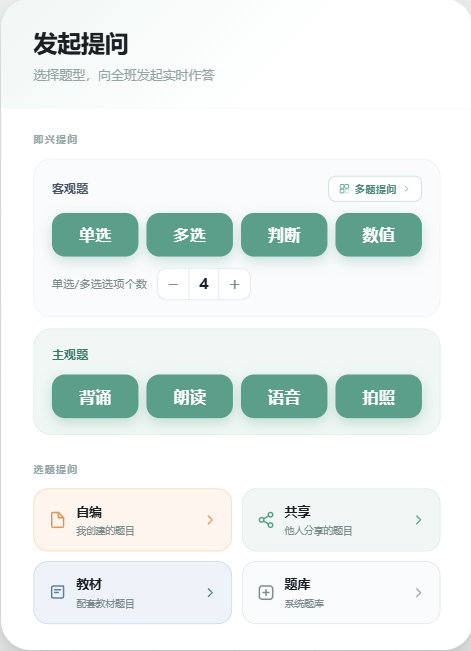

| 属性 | 值 |
|------|-----|
| **图片文件** | `点击问.png` |
| **存放路径** | `docs/images/点击问.png` |
| **面板尺寸** | **宽 470px × 高 650px** |
| **显示位置** | **屏幕居中**（水平垂直居中） |
| **路由** | 无路由跳转，以**浮层/弹窗**形式覆盖在页面之上 |

### 4.3 面板按钮功能一览

> 点击 [问] 后弹出题型选择面板，内部包含以下功能按钮：

#### 第一组：题型选择（单题模式）

点击以下四个按钮 → **路由跳转**到缩小答题进程，携带不同参数：

| 按钮 | 携带参数 | 说明 |
|------|----------|------|
| **单选** | `type=单选` + `optionCount`（选项个数） | 需先选择选项个数，再跳转 |
| **多选** | `type=多选` + `optionCount`（选项个数） | 需先选择选项个数，再跳转 |
| **判断** | `type=判断` | 直接跳转，无需选项个数 |
| **数值** | `type=数值` | 直接跳转，无需选项个数 |

> **与多提提问的区别**：这四个按钮是**单个客观题**流程，跳转到缩小答题进程后，结束答题直接跳转**客观题详情**，不走多题详情页。

#### 第二组：口语/朗读

| 按钮 | 携带参数 | 说明 |
|------|----------|------|
| **背诵** | `type=背诵` | 路由跳转 → **读背页面**，选择背诵内容 |
| **朗读** | `type=朗读` | 路由跳转 → **读背页面**，选择朗读内容 |

#### 第三组：输入方式

| 按钮 | 功能说明 | 后续动作 |
|------|----------|----------|
| **语音** | 通过语音出题/截屏出题 | `el-dialog` 弹出 → **语音题选择**（70%居中） |
| **拍照** | 🔒 置灰（暂不实现） | — |

#### 第四组：题目来源

> 四个按钮 → **路由跳转**到同一个选题提问页面，通过 Tab 区分。

| 按钮 | 携带参数 | 说明 |
|------|----------|------|
| **自编** | `source=self` | Tab: 自编，左侧题集列表 + 题型/难度筛选 |
| **共享** | `source=shared` | Tab: 共享，左侧题集列表 + 题型/难度筛选 |
| **教材** | `source=textbook` | Tab: 教材，左侧树筛选 + 题型/难度筛选 |
| **题库** | `source=bank` | Tab: 题库，左侧教材树/知识点树 + 题型/难度筛选 |

### 4.4 多提提问（子组件）

> **触发**：在"问"面板内部，点击 **[多提提问]** 按钮。
> **位置**：在"问"面板（470×650）**内部弹出**，不是独立弹窗。

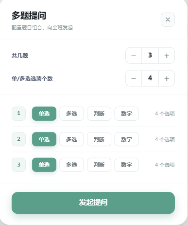

| 属性 | 值 |
|------|-----|
| **图片文件** | `多提提问.png` |
| **存放路径** | `docs/images/多提提问.png` |
| **组件尺寸** | **宽 390px × 高 460px** |
| **显示位置** | **"问"面板内部**（相对于父面板定位） |
| **路由** | 无路由跳转，是"问"面板的**子组件** |

#### 功能详解

```
┌─────────────────────────────────────┐ ┬
│         多提提问（问面板内部）          │ │
│                                     │ │
│  共几题    [ − ]  3  [ + ]          │ │  ← 加减题目总数
│                                     │ │
│  单/多选选项个数  [ − ]  4  [ + ]    │ │  ← 加减每题选项个数
│                                     │ │
│  ┌──────────────────────────────┐   │ │
│  │  第1题   ○ 单选  ○ 多选       │   │ │  390px
│  │           ○ 判断  ○ 数值      │   │ │
│  ├──────────────────────────────┤   │ │
│  │  第2题   ○ 单选  ○ 多选       │   │ │  ← 题目数量
│  │           ○ 判断  ○ 数值      │   │ │    由"共几题"决定
│  ├──────────────────────────────┤   │ │
│  │  第3题   ○ 单选  ○ 多选       │   │ │
│  │           ○ 判断  ○ 数值      │   │ │
│  └──────────────────────────────┘   │ │
│                                     │ │
│  ┌──────────────────────────────┐   │ │
│  │         [发起提问]             │   │ │  ← 提交批量题目
│  └──────────────────────────────┘   │ │
│                                     │ │
│           [确认]  [取消]             │ │
│                                     │ │
└─────────────────────────────────────┘ ┴
                  460px
```

| 功能区域 | 操作方式 | 说明 |
|----------|----------|------|
| **共几题** | 点击 `[−]` / `[+]` | 控制题目总数，下方题目行数随之增减 |
| **单/多选选项个数** | 点击 `[−]` / `[+]` | 控制每道单选/多选的选项数量（如 4 个选项 = A/B/C/D） |
| **每题的题型选择** | 点击 ○ 单选 | 每道题**独立选择**题型：单选、多选、判断、数值四选一 |
| **题目行数** | 由"共几题"决定 | 共几题 = 3，则显示第1题~第3题，每行独立配置题型 |
| **发起提问** | 点击按钮 | 将配置好的多道题目**一次性发布**到课堂中，学生端同步收到题目 |
| **确认** | 点击按钮 | 保存当前配置（不发布），返回"问"面板主界面 |
| **取消** | 点击按钮 | 放弃所有配置，返回"问"面板主界面 |

#### 交互逻辑

```
"问"面板内点击 [多提提问]
        │
        ▼
┌───────────────────────────────┐
│  问面板内切换显示"多提提问"子组件  │  ← 390×460，覆盖/替换"问"面板主体区域
│                               │
│  1. 默认 共几题 = 3             │
│  2. 默认 选项个数 = 4           │
│  3. 默认每题都是"单选"          │
│        │                      │
│  用户操作：                     │
│  ├─ 调"共几题" → 题目行数 ±    │
│  ├─ 调"选项个数" → 每题选项数 ± │
│  └─ 每行选题型 → 单选/多选/判断/数值 │
│        │                      │
│        ├── 点击 [发起提问]       │
│        │        │              │
│        │        ▼              │
│        │   ┌───────────────┐   │
│        │   │ 发布题目到课堂  │   │  ← 一次性推送所有题目到学生端
│        │   │ 关闭多提提问面板 │   │
│        │   └───────────────┘   │
│        │                      │
│        ├── 点击 [确认]          │
│        │        │              │
│        │        ▼              │
│        │   保存配置，返回主界面   │  ← 题目暂存不发布
│        │                      │
│        └── 点击 [取消] → 放弃配置，返回主界面
│                               │
└───────────────────────────────┘
```

### 4.5 缩小答题进程

> **触发入口有两个**，进入后根据来源判断单题还是多题模式：

#### 入口一：题型按钮（单题模式）

从"问"面板点击 **单选/多选/判断/数值** → 路由跳转：

| 按钮 | 路由参数 |
|------|----------|
| 单选 | `/ask/progress?type=单选&optionCount=4` |
| 多选 | `/ask/progress?type=多选&optionCount=4` |
| 判断 | `/ask/progress?type=判断` |
| 数值 | `/ask/progress?type=数值` |

#### 入口二：多提提问（多题模式）

从"多提提问"点击 **[发起提问]** → 路由跳转：

| 来源 | 路由参数 |
|------|----------|
| 多提提问 | `/ask/progress?mode=batch&count=3` |

---

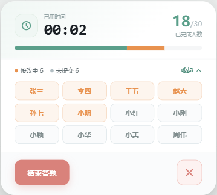

| 属性 | 值 |
|------|-----|
| **图片文件** | `缩小答题进程.png` |
| **存放路径** | `docs/images/缩小答题进程.png` |
| **路由** | `/ask/progress`（待实现） |
| **跳转方式** | `router.push('/ask/progress?type=单选&...')` |

#### Type 判断逻辑

进入页面后根据路由参数判断模式，**结束答题跳转目标不同**：

```
进入 /ask/progress
        │
        ├── ?mode=batch（多题模式）
        │        │
        │        └── 点击 [结束答题] → 路由跳转 → 多题详情（全屏）
        │
        └── ?type=单选/多选/判断/数值（单题模式）
                 │
                 └── 点击 [结束答题] → 路由跳转 → 客观题详情
```

#### 按钮功能

| 按钮 | 类型 | 功能 | 后续 |
|------|------|------|------|
| **结束答题** | 路由跳转 | 结束答题 | → 单题模式跳**客观题详情** / 多题模式跳**多题详情** |
| **关闭** | 组件弹出 | 关闭答题进程 | → `el-dialog` 居中弹框确认 |

#### 关闭 → 确认弹框（同上，两种模式一致）

| 弹框按钮 | 行为 |
|----------|------|
| **确定** | 取消答题 → 路由跳转回悬浮球主界面 `/` |
| **取消** | 关闭弹框，留在当前页 |

#### 流程图

```
问面板
├── [单选/多选/判断/数值] → /ask/progress?type=xxx  （单题）
│                               │
│                               ├── [结束答题] → 客观题详情
│                               └── [关闭] → el-dialog → 确定/取消
│
└── [多提提问] → [发起提问] → /ask/progress?mode=batch  （多题）
                                │
                                ├── [结束答题] → 多题详情
                                └── [关闭] → el-dialog → 确定/取消
```

### 4.6 结束答题 → 多题详情

> **触发**：缩小答题进程中点击 **[结束答题]** → **路由跳转**到此页面。

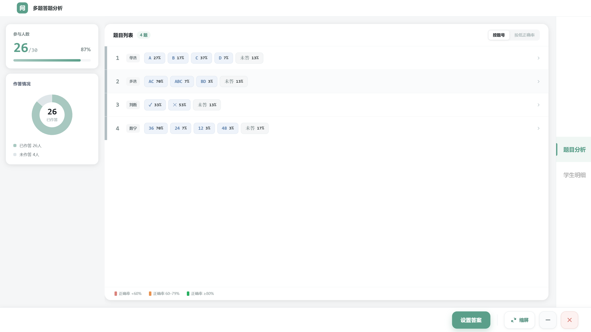

| 属性 | 值 |
|------|-----|
| **图片文件** | `多题详情.png` |
| **存放路径** | `docs/images/多题详情.png` |
| **页面尺寸** | **全屏** |
| **路由** | `/ask/detail`（待实现） |
| **跳转方式** | `router.push('/ask/detail')` |

#### Tab 切换（组件切换，不走路由）

页面内两个 Tab，通过 `v-if`/`v-show` 切换内容：

| Tab | 截图 | 内容 |
|-----|------|------|
| **题目详情** | `多题详情.png` | 左侧题目列表 + 右侧题目内容、选项、正确答案 |
| **学生明细** | `多题详情-学生明细.png` | 每个学生的作答情况 |

```
┌─────────────────────────────────────────┐
│         多题详情（全屏）                   │
│                                         │
│  ┌────────────┐ ┌────────────┐          │
│  │  题目详情    │ │  学生明细    │  ← Tab 切换 │
│  └────────────┘ └────────────┘          │
│                                         │
│  ┌────题目列表────┐ ┌────────────────┐   │
│  │  第1题 单选    │ │                │   │
│  │  第2题 多选 ◄──┼─ 点击跳转        │   │
│  │  第3题 判断    │ │  题目详情内容    │   │
│  │  第4题 数值    │ │                │   │
│  │  ...         │ │                │   │
│  └──────────────┘ └────────────────┘   │
│                                         │
│         [缩屏]          [设置答案]        │
│                                         │
└─────────────────────────────────────────┘
```

#### 题目列表 → 路由跳转

点击题目列表中的某道题 → **路由跳转**到该题的详情页：

| 操作 | 类型 | 目标路由 | 截图 |
|------|------|----------|------|
| 点击题目列表中的题目 | 路由跳转 | `/ask/detail/:questionId` | **客观题详情.png** |

#### 按钮功能

| 按钮 | 类型 | 功能 | 后续 |
|------|------|------|------|
| **缩屏** | 待定 | 先保留 | — |
| **设置答案** | 组件弹出 | 设置多选题的正确答案 | `el-dialog` 弹出 → **多选题设置答案.png** |

### 4.7 设置答案（组件弹出）

> **触发**：多题详情页点击 **[设置答案]** → `el-dialog` 弹出。

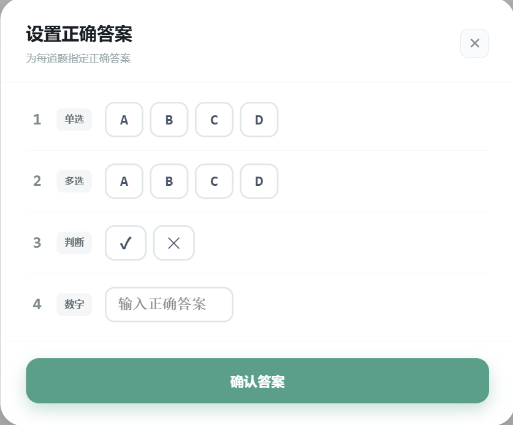

| 属性 | 值 |
|------|-----|
| **图片文件** | `多选题设置答案.png` |
| **存放路径** | `docs/images/多选题设置答案.png` |
| **弹出方式** | `el-dialog`（模态框，不走路由） |

#### 完整链路（问线路）

```
悬浮球 [问]
    │
    └── 路由跳转 ──→ 点击问（470×650 居中弹框）
                        │
                        ├── [多提提问] → 缩小答题进程（多题） → 多题详情 → 客观题详情
                        │
                        ├── [单选/多选/判断/数值] → 缩小答题进程（单题） → 客观题详情
                        │
                        ├── [背诵/朗读] → 读背(970×710) → 朗背答题进行中(type=recite) → 读背判分
                        │
                        ├── [语音] → 语音题选择(70%)
                        │               ├── 语音出题 → 朗背答题进行中 → 语音分析 → 语音学生分析
                        │               ├── 截屏出题 → 朗背答题进行中 → 语音分析
                        │               └── 先答题后设置 → 朗背答题进行中 → 语音分析
                        │
                        └── [自编/共享/教材/题库] → 选题提问(四Tab)
                                                        │
                                                        ├── P5主观·语音 → 朗背进行中 → 语音分析
                                                        ├── P5主观·拍照 → 朗背进行中 → 拍照分析 → 语音学生分析
                                                        ├── 客观·单题 → 缩小答题进程 → 客观题详情
                                                        └── 客观·多题 → 多题答题中 → 多题详情
```

```
┌─────────────────────────────────┐  ┬
│          点击问 — 出题面板        │  │
│                                 │  │
│  ┌─────────────────────────┐    │  │
│  │      [多提提问]           │    │  │
│  └─────────────────────────┘    │  │
│                                 │  │
│  题型：                         │  │
│  ┌──────┐ ┌──────┐ ┌──────┐    │  │
│  │ 单选  │ │ 多选  │ │ 判断  │    │  │  470px
│  └──────┘ └──────┘ └──────┘    │  │
│  ┌──────┐                      │  │
│  │ 数值  │                      │  │
│  └──────┘                      │  │
│                                 │  │
│  口语：                         │  │
│  ┌──────┐ ┌──────┐             │  │
│  │ 背诵  │ │ 朗读  │             │  │
│  └──────┘ └──────┘             │  │
│                                 │  │
│  输入方式：                      │  │
│  ┌──────┐ ┌──────┐             │  │
│  │ 语音  │ │ 拍照  │             │  │
│  └──────┘ └──────┘             │  │
│                                 │  │
│  题目来源：                      │  │
│  ┌────┐ ┌────┐ ┌────┐ ┌────┐  │  │
│  │自编│ │共享│ │教材│ │题库│  │  │
│  └────┘ └────┘ └────┘ └────┘  │  │
│                                 │  │
└─────────────────────────────────┘  ┴
                 650px

          ↓ 屏幕居中显示 ↓
┌──────────────────────────────────────────┐
│                                          │
│          ┌─────────────────┐             │
│          │                 │             │
│          │   点击问.png     │             │
│          │   470 × 650     │             │
│          │                 │             │
│          └─────────────────┘             │
│              ↑ 居中 ↑                     │
│          Electron 全屏透明窗口             │
└──────────────────────────────────────────┘
```

### 4.8 客观题详情

> **触发入口有两个**：

| 入口 | 来源 | 说明 |
|------|------|------|
| 单题模式 | 缩小答题进程（从题型按钮进入）→ 点击 [结束答题] | 仅一道题 |
| 多题模式 | 多题详情页 → 点击题目列表中的某道题 | 多题中的一道 |

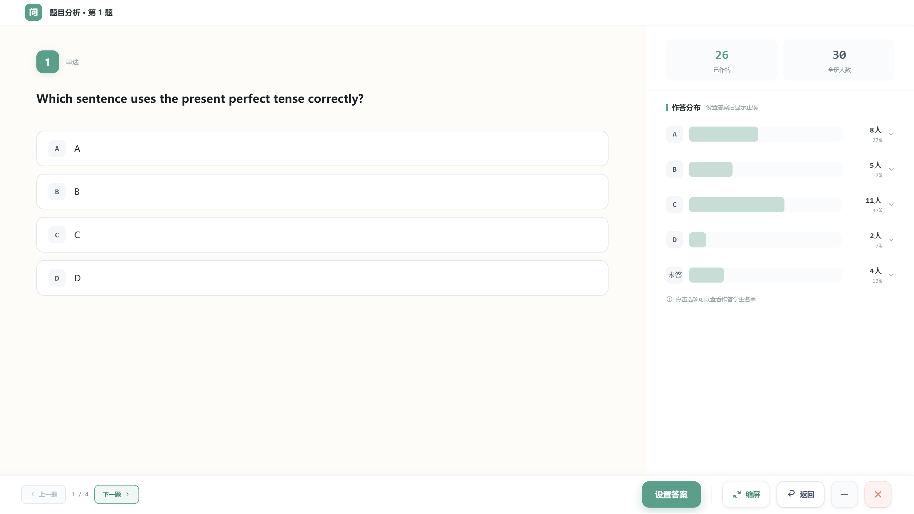

| 属性 | 值 |
|------|-----|
| **图片文件** | `客观题详情.png` |
| **存放路径** | `docs/images/客观题详情.png` |
| **路由** | `/ask/detail/:questionId`（待实现） |
| **跳转方式** | `router.push('/ask/detail/' + questionId)` |

#### 上一题 / 下一题 显示逻辑

根据当前题目所属的题目数量决定是否显示切换按钮：

| 场景 | 题目数 | 切换按钮 |
|------|--------|----------|
| **单题模式**（从题型按钮进入） | = 1 | **不显示**上一题 / 下一题 |
| **多题模式**（从多题详情列表进入） | > 1 | **显示** 上一题 / 下一题 |

```
单题（=1）                       多题（>1）
┌──────────────────┐          ┌──────────────────────┐
│   客观题详情      │          │   客观题详情           │
│                  │          │                      │
│   题目内容       │          │  [← 上一题] [下一题 →] │
│   选项...        │          │                      │
│                  │          │   题目内容            │
│                  │          │   选项...             │
│   [设置答案]     │          │                      │
│                  │          │   [设置答案]          │
└──────────────────┘          └──────────────────────┘
```

#### 按钮功能

| 按钮 | 类型 | 功能 | 后续 |
|------|------|------|------|
| **设置答案** | 组件弹出 | 设置该题正确答案 | `el-dialog` 弹出 → **单选题设置答案.png** |
| **上一题** | 路由跳转 | 切换到上一题 | `router.push('/ask/detail/' + prevId)`，仅多题模式显示 |
| **下一题** | 路由跳转 | 切换到下一题 | `router.push('/ask/detail/' + nextId)`，仅多题模式显示 |

### 4.9 设置答案（组件弹出）

> **触发**：客观题详情页点击 **[设置答案]** → `el-dialog` 弹出。

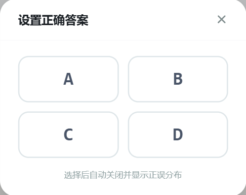

| 属性 | 值 |
|------|-----|
| **图片文件** | `单选题设置答案.png` |
| **存放路径** | `docs/images/单选题设置答案.png` |
| **弹出方式** | `el-dialog`（模态框，不走路由） |

#### 根据题型差异化渲染

弹框内部根据当前题目的**题型**，渲染不同的内容：

| 题型 | 渲染内容 | 说明 |
|------|----------|------|
| **单选** | `A` `B` `C` `D` ... | 根据"选项个数"渲染对应个数的单选框 |
| **多选** | `A` `B` `C` `D` ... | 根据"选项个数"渲染对应个数的多选框 |
| **判断** | `✓` `×` | 对 / 错 两个选项 |
| **数字** | 输入框 | 限制：只能数字、小数点、负号；负号只能在开头；小数点只能出现一次；最大 16 位 |

```
题型 = 单选                    题型 = 判断
┌──────────────────┐          ┌──────────────────┐
│  设置正确答案      │          │  设置正确答案      │
│                  │          │                  │
│  ○ A             │          │  ○ ✓             │
│  ○ B             │          │  ○ ×             │
│  ○ C             │          │                  │
│  ○ D             │          │                  │
│                  │          │                  │
│  选项个数: 4      │          └──────────────────┘
└──────────────────┘
                               题型 = 数字
题型 = 多选                    ┌──────────────────┐
┌──────────────────┐          │  设置正确答案      │
│  设置正确答案      │          │                  │
│                  │          │  [____________]  │
│  ☑ A             │          │  输入数值答案      │
│  ☑ B             │          │                  │
│  ☑ C             │          │  限制:           │
│  ☑ D             │          │  · 仅数字/小数点/负号│
│                  │          │  · 负号仅开头     │
│  选项个数: 4      │          │  · 小数点仅一次   │
└──────────────────┘          │  · 最大16位      │
                              └──────────────────┘
```

### 4.10 路由说明

> **"问"面板本身不涉及路由跳转**，它是一个浮层弹窗，覆盖在 `HomeView` 之上。
> 后续从面板内点击具体功能后，才触发跳转：

| 面板按钮 | 触发后的目标路由 | 页面说明 |
|----------|-----------------|----------|
| 单选 / 多选 / 判断 / 数值 | `/ask/edit?type=单选` 等 | 题目编辑页 |
| 背诵 / 朗读 | `/ask/edit?type=背诵` 等 | 背诵/朗读内容编辑页 |
| 共享 | `/ask/shared` | 共享题库列表页 |
| 教材 | `/ask/textbook` | 教材题库列表页 |
| 题库 | `/ask/bank` | 个人/校本题库页 |
| 自编 | `/ask/edit?source=self` | 自编题目编辑页 |

### 4.11 面板交互逻辑

```
悬浮球 [问] 按钮 click
        │
        ▼
┌───────────────────────┐
│  显示"点击问"面板       │  ← 浮层弹出，470×650 居中
│  (v-if / v-show 控制)  │     z-index 高于悬浮球
│                       │
│  用户点击某个功能按钮    │
│        │              │
│        ├─ 题型按钮 ───→ 关闭面板 → router.push 到编辑页
│        ├─ 口语按钮 ───→ 关闭面板 → router.push 到编辑页
│        ├─ 来源按钮 ───→ 关闭面板 → router.push 到题库页
│        └─ 语音/拍照 ──→ 调用系统硬件 API
│                       │
└───────────────────────┘
```

### 4.12 实现要点

| 要点 | 说明 |
|------|------|
| **弹窗组件** | 新建 `AskPanel.vue`，或作为 `FloatingBall.vue` 的子组件 |
| **显示控制** | 点击 [问] → `showAskPanel = true`；关闭/跳转时 → `false` |
| **居中定位** | `position: fixed; top: 50%; left: 50%; transform: translate(-50%, -50%)` |
| **固定尺寸** | `width: 470px; height: 650px` |
| **层级** | `z-index` 高于悬浮球 (悬浮球 `z-index: 2147483647`，面板需更高) |
| **可交互区域** | 面板 DOM 需加 `data-overlay-hitbox="true"`，确保鼠标不穿透 |
| **多提提问子组件** | 新建 `BatchAsk.vue`，在 `AskPanel.vue` 内部 `v-if` 切换显示，尺寸 390×460 |

---

### 4.13 背诵/朗读 → 读背页面

> **触发**：点击问面板中的 **[背诵]** 或 **[朗读]** → **路由跳转**到此页面。

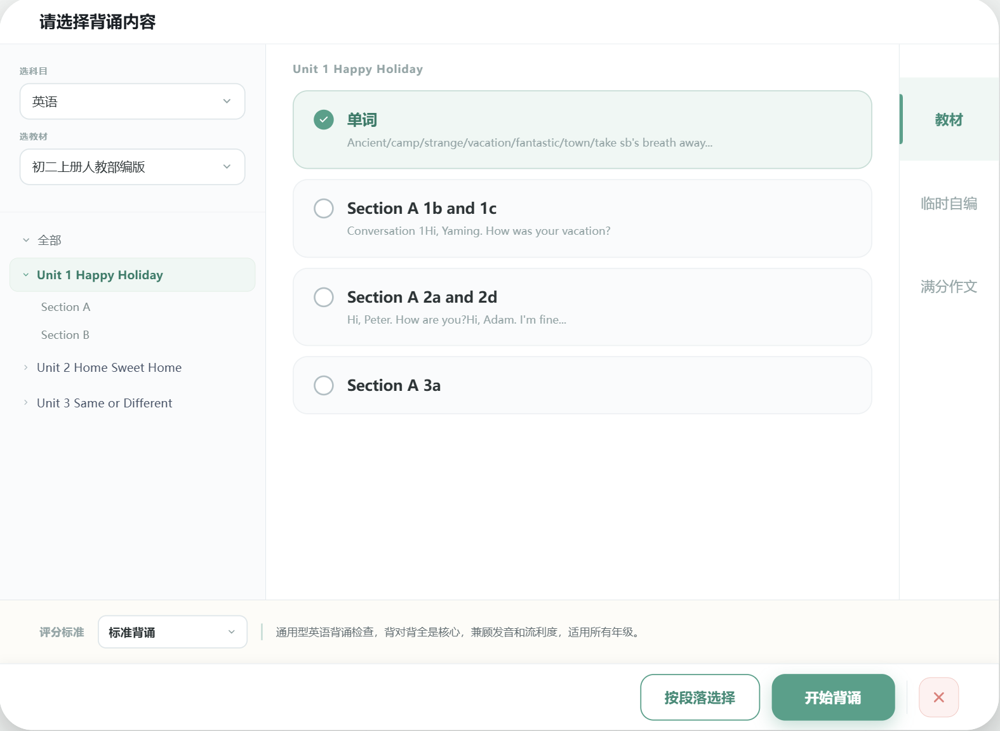

| 属性 | 值 |
|------|-----|
| **图片文件** | `读背.png` |
| **存放路径** | `docs/images/读背.png` |
| **页面尺寸** | **宽 970px × 高 710px** |
| **显示位置** | **屏幕居中** |
| **路由** | `/ask/read-recite?type=背诵` 或 `/ask/read-recite?type=朗读`（待实现） |
| **跳转方式** | `router.push('/ask/read-recite?type=背诵')` |

#### 页面结构

```
┌─────────────────────────────────────────────────────┐ ┬
│                    读背页面                           │ │
│                                                     │ │
│  ┌──────────┐ ┌──────────┐ ┌──────────┐            │ │
│  │   教材    │ │  临时自编  │ │  满分作文  │ ← 三Tab切换 │ │  970px
│  └──────────┘ └──────────┘ └──────────┘            │ │
│                                                     │ │
│  ┌───────────────────────────────────────────────┐  │ │
│  │                                               │  │ │
│  │           Tab 内容区域                         │  │ │
│  │                                               │  │ │
│  │                                               │  │ │  710px
│  │                                               │  │ │
│  └───────────────────────────────────────────────┘  │ │
│                                                     │ │
│              [按段落选择]（教材/满分作文可见）          │ │
│                                                     │ │
└─────────────────────────────────────────────────────┘ ┴
```

#### 三个 Tab 总览

| Tab | 截图 | 核心功能 |
|-----|------|----------|
| **教材** | `读背.png` | 选择科目 → 选教材 → 树形目录选择内容 |
| **临时自编** | `临时自编.png` | 语音录入（先保留）→ 内容渲染 |
| **满分作文** | `满分作文.png` | 内容块单选 |

---

### 4.13.1 Tab：教材


#### 功能点

| 序号 | 功能 | 操作方式 | 说明 |
|------|------|----------|------|
| ① | **选择科目** | 下拉框 | 筛选教材所属科目 |
| ② | **选教材** | 点击按钮 → `el-dialog` 居中弹出 | 弹出 **选择教材.png**，只有确定/取消按钮 |
| ③ | **Tree 树组件** | 点击展开/选中节点 | 可单独选中某个教材节点 |
| ④ | **教材区域** | 自适应高度 | 超出高度出现**滚动条** |

#### 选教材弹框（el-dialog）

> 点击 [选教材] → 居中弹出。

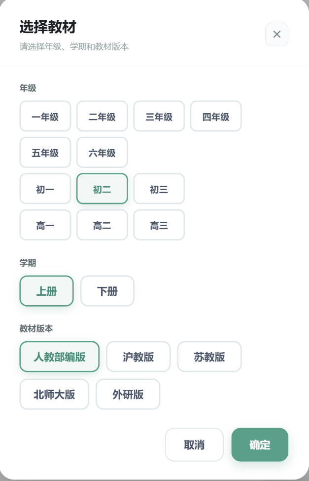

| 属性 | 值 |
|------|-----|
| **图片文件** | `选择教材.png` |
| **弹出方式** | `el-dialog`（模态框，不走路由） |

| 按钮 | 行为 |
|------|------|
| **确定** | 确认选择的教材 → 关闭弹框，回填到教材页 |
| **取消** | 放弃选择 → 关闭弹框 |

---

### 4.13.2 Tab：临时自编

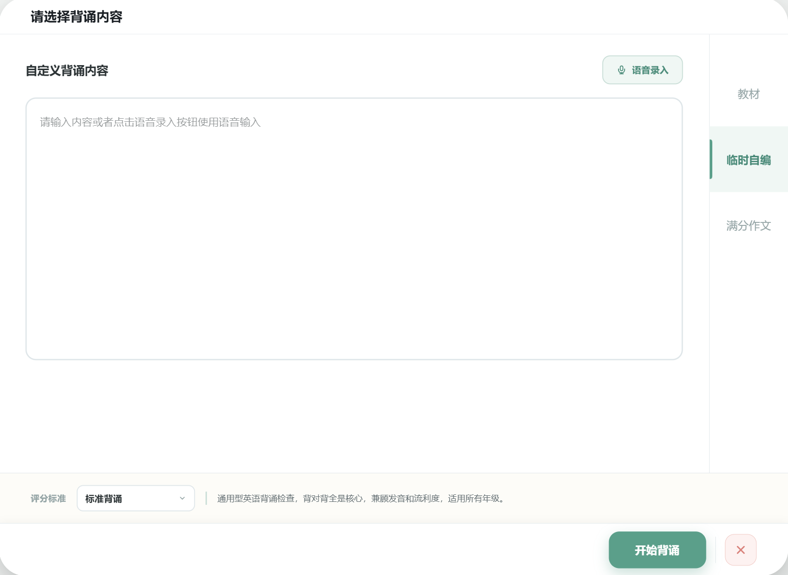

| 功能 | 状态 | 说明 |
|------|------|------|
| **语音录入** | 🔒 先保留 | 后续实现，调用麦克风语音转文字 |
| **内容渲染** | ✅ 可用 | 根据语音输入的内容渲染展示 |

---

### 4.13.3 Tab：满分作文

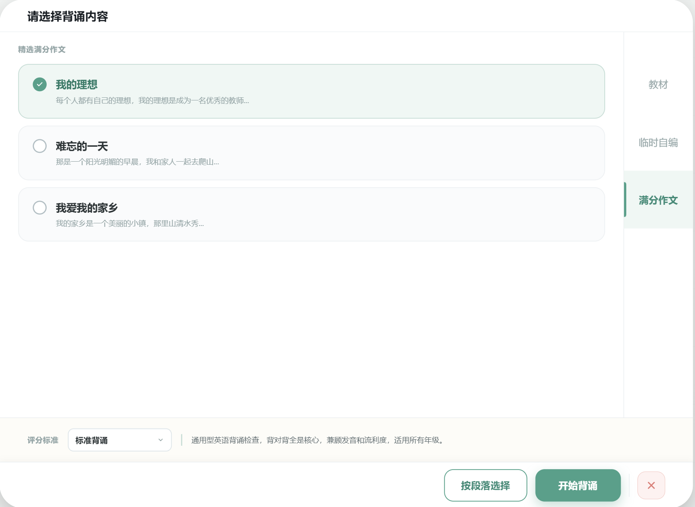

#### 功能点

| 功能 | 操作 | 说明 |
|------|------|------|
| **内容块单选** | 点击选中 | 作文内容以块的形式展示，可单选某个内容块 |

---

### 4.13.4 通用功能：按段落选择

> **渲染范围**：只在 **教材** 和 **满分作文** 两个 Tab 中显示该按钮。
> **触发**：点击 **[按段落选择]** → `el-dialog` 弹出。

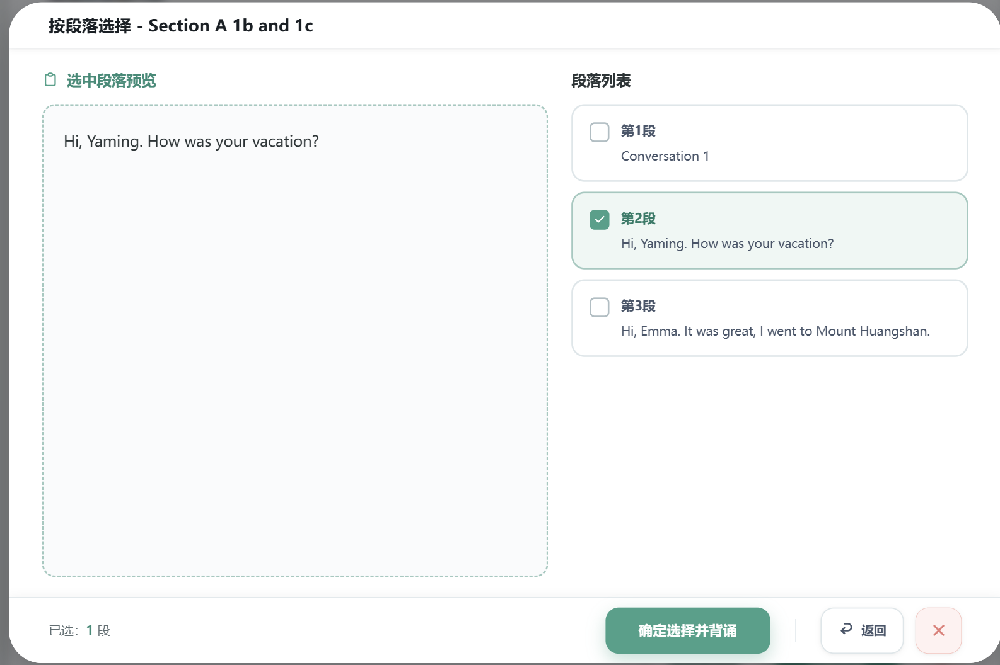

| 属性 | 值 |
|------|-----|
| **图片文件** | `按段落选择.png` |
| **弹出方式** | `el-dialog`（模态框，不走路由） |
| **渲染条件** | 仅在 **教材 Tab** 和 **满分作文 Tab** 显示 |

#### 功能

弹框内部可以**选择段落**（勾选需要的段落）。

#### 按钮

| 按钮 | 类型 | 行为 |
|------|------|------|
| **确定选择并背诵** | 路由跳转 | 关闭当前页面 + 关闭父页面 → 跳转 **朗背答题进行中.png** |
| **开始背诵** | 路由跳转 | 跳转 **朗背答题进行中.png** |
| **关闭** | 路由返回 | 关闭当前路由 → 回到悬浮球主界面（胶囊页面） |

---

### 4.13.5 朗背答题进行中

> **多入口页面**：读背流程和语音流程都会跳转到此页面，根据入口不同，左侧内容区和结束答题目标不同。

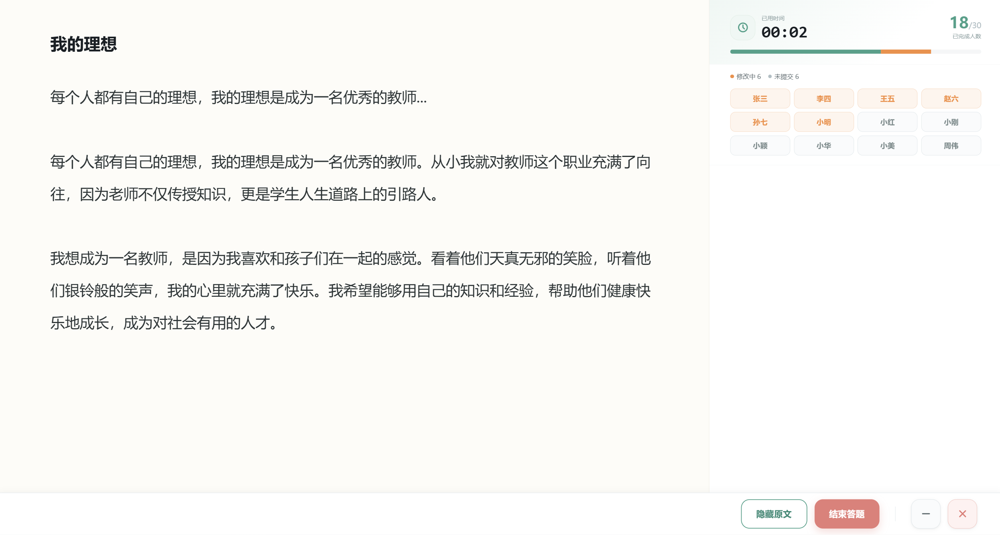

| 属性 | 值 |
|------|-----|
| **图片文件** | `朗背答题进行中.png` |
| **页面尺寸** | **全屏** |
| **路由** | `/ask/recite-progress?type=xxx`（待实现） |

#### 入口差异

| 入口来源 | type | 左侧内容 | [结束答题] 跳转目标 |
|----------|------|----------|---------------------|
| 读背（背诵/朗读） | `recite` | 显示**文本原文** | → **读背判分.png** |
| 语音 → 语音出题 | `voice` | 显示**题目文本**（未设置题目时为空） | → **语音分析.png** |
| 语音 → 截屏出题 | `screenshot` | 显示**截图图片** | → **语音分析.png** |

#### 页面结构

```
┌──────────────────────────────────────────────────────┐
│              朗背答题进行中（全屏）                      │
│                                                      │
│  ┌──────────┐  ┌─────────────────────────────────┐   │
│  │          │  │                                 │   │
│  │  原文/    │  │        答题/背诵区域              │   │
│  │  题目/    │  │                                 │   │
│  │  图片     │  │                                 │   │
│  └──────────┘  └─────────────────────────────────┘   │
│                                                      │
│   [隐藏原文]                              [结束答题]   │
│                                                      │
└──────────────────────────────────────────────────────┘
```

#### 按钮功能

| 按钮 | 功能 | 说明 |
|------|------|------|
| **隐藏原文** | 切换显示/隐藏 | 隐藏/显示**左侧内容区域**（文本/题目/图片） |
| **结束答题** | 路由跳转 | 根据 `type` 跳转不同目标：读背→读背判分 / 语音→语音分析 |

---

### 4.13.6 读背判分

> **触发**：朗背答题进行中点击 **[结束答题]** → **路由跳转**到此页面。

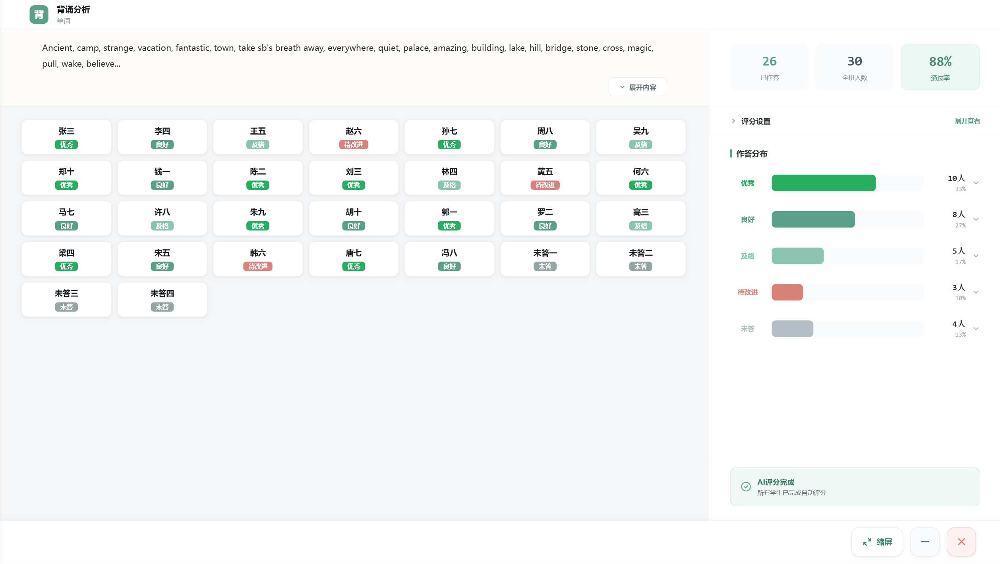

| 属性 | 值 |
|------|-----|
| **图片文件** | `读背判分.png` |
| **路由** | `/ask/recite-score`（待实现） |

#### 功能

| 功能 | 说明 |
|------|------|
| **展开内容** | 展开显示题目内容 |
| **隐藏内容** | 隐藏/收起题目内容 |

> 展开内容 / 隐藏内容是**切换按钮**，用于控制题目内容的显示与隐藏。

---

### 4.13.7 读背完整链路

```
问面板 [背诵] / [朗读]
        │
        └── 路由跳转 ──→ 读背页面（970×710 居中）
                            │
                            ├── Tab: 教材
                            │   ├── 选择科目（下拉框）
                            │   ├── 选教材 → el-dialog → 选择教材.png
                            │   │               ├── 确定 → 回填
                            │   │               └── 取消 → 关闭弹框
                            │   └── Tree 树组件（点击选择节点）
                            │
                            ├── Tab: 临时自编
                            │   ├── 语音录入（🔒保留）
                            │   └── 内容渲染
                            │
                            ├── Tab: 满分作文
                            │   └── 内容块单选
                            │
                            └── [按段落选择]（仅教材/满分作文显示）
                                    │
                                    └── el-dialog → 按段落选择.png
                                            │
                                            ├── [确定选择并背诵] → 关闭父子页
                                            ├── [开始背诵]        → 朗背答题进行中（全屏）
                                            └── [关闭]            │
                                                                  │
                                            朗背答题进行中（全屏）
                                            ├── [隐藏原文] → 切换左侧文档 显/隐
                                            └── [结束答题] → 读背判分
                                                              │
                                                              ├── 展开内容
                                                              └── 隐藏内容
```

---

### 4.14 语音 → 语音题选择

> **触发**：问面板点击 **[语音]** → `el-dialog` 弹出。

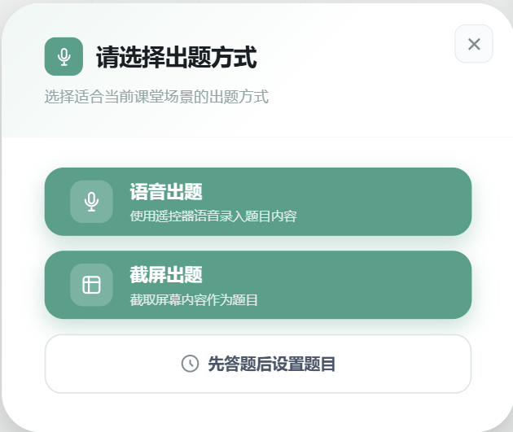

| 属性 | 值 |
|------|-----|
| **图片文件** | `语音题选择.png` |
| **弹出方式** | `el-dialog`（模态框，不走路由） |
| **弹框尺寸** | **屏幕占比 70%**（居中） |

#### 功能按钮

| 按钮 | 类型 | 功能 | 后续 |
|------|------|------|------|
| **语音出题** | 组件切换 | 弹框内切换内容区 | → 显示 **语音出题.png** |
| **截屏出题** | Electron 截屏 | 调用 Node 截图插件截取屏幕 | → 截图完成 → 路由跳转 **朗背答题进行中**（type=screenshot） |
| **先答题后设置题目** | 路由跳转 | 暂不设置题目，直接开始答题 | → 跳转 **朗背答题进行中**（type=voice，无题目） |

#### 截屏出题流程

```
[截屏出题] → Electron Node 插件截屏 → 返回图片给前端
                                            │
                                            └── 路由跳转 → 朗背答题进行中
                                                           type=screenshot
                                                           左侧显示截图图片
```

> **截屏插件**：需要在 Electron 主进程中通过 Node 实现屏幕截图功能，截图完成后将图片数据传给渲染进程。

---

### 4.15 语音出题（组件切换）

> **触发**：语音题选择弹框中点击 **[语音出题]** → 弹框内组件切换。

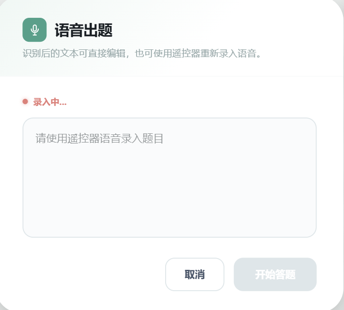

| 按钮 | 类型 | 功能 | 后续 |
|------|------|------|------|
| **开始答题** | 路由跳转 | 开始语音答题 | → 跳转 **朗背答题进行中**（type=voice） |

> 点击 [结束答题] 与截屏出题逻辑一致 → 跳转 **语音分析.png**。

#### 未设置题目场景

当从 **[先答题后设置题目]** 进入朗背答题进行中时，左侧不显示题目内容：

> 参考：**未设置题目语音分析.png**

进入语音分析时，与设置了题目的语音分析页面相同，仅业务逻辑有细微差别。

---

### 4.16 语音分析

> **触发**：朗背答题进行中（type=voice/screenshot）→ 点击 **[结束答题]** → 路由跳转。

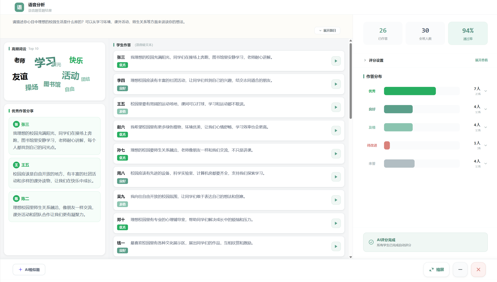

| 属性 | 值 |
|------|-----|
| **图片文件** | `语音分析.png` |
| **路由** | `/ask/voice-analysis`（待实现） |

#### 功能

| 功能 | 类型 | 说明 |
|------|------|------|
| **学生作答区域** | 路由跳转 | 点击单个学生 → 跳转 **语音学生答题分析.png**，携带 `studentId` |

---

### 4.17 语音学生答题分析

> **触发**：语音分析页点击某个学生 → 路由跳转。

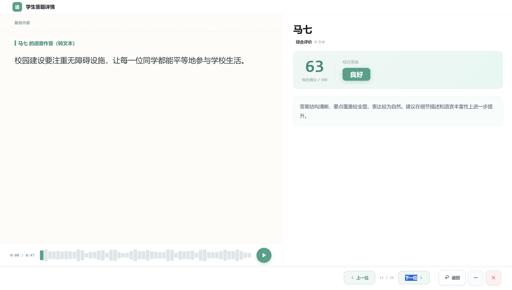

| 属性 | 值 |
|------|-----|
| **图片文件** | `语音学生答题分析.png` |
| **路由** | `/ask/voice-analysis/:studentId`（待实现） |

#### 按钮功能

| 按钮 | 类型 | 说明 |
|------|------|------|
| **上一位** | 路由跳转 | 切换到上一个学生 → `router.push` 带新 `studentId` |
| **下一位** | 路由跳转 | 切换到下一个学生 → `router.push` 带新 `studentId` |
| **返回** | 路由返回 | 回到语音分析页面 → `router.back()`，携带当前 `studentId` |

---

### 4.18 语音完整链路

```
问面板 [语音]
    │
    └── el-dialog ──→ 语音题选择（70%居中）
                        │
                        ├── [语音出题] → 组件切换 → 语音出题.png
                        │                   │
                        │                   └── [开始答题] → 朗背答题进行中（type=voice）
                        │
                        ├── [截屏出题] → Electron截屏 → 朗背答题进行中（type=screenshot）
                        │
                        └── [先答题后设置题目] → 朗背答题进行中（type=voice, 无题目）
                        
                        朗背答题进行中（全屏）
                        ├── type=recite → [结束答题] → 读背判分
                        └── type=voice/screenshot → [结束答题] → 语音分析
                                                                      │
                                                                      └── 点击学生 → 语音学生答题分析
                                                                                      ├── [上一位]/[下一位]
                                                                                      └── [返回] → 语音分析
```

---

### 4.19 选题提问（自编/共享/教材/题库）

> **触发**：问面板点击 **[自编]/[共享]/[教材]/[题库]** → **路由跳转**到同一个页面，通过 Tab 切换四个子组件。

| 属性 | 值 |
|------|-----|
| **路由** | `/ask/select-question?source=self\|shared\|textbook\|bank`（待实现） |
| **页面尺寸** | 全屏（待确认） |

#### 四个 Tab 结构对比

| Tab | 截图 | 左侧 | 顶部筛选 | 说明 |
|-----|------|------|----------|------|
| **自编** | `选题提问自编.png` | 题集列表（可切换筛选题目） | 题型下拉框 + 难度下拉框 | 个人自编题目 |
| **共享** | `选题提问共享.png` | 题集列表（可切换筛选题目） | 题型下拉框 + 难度下拉框 | 共享题库 |
| **教材** | `选题提问教材.png` | **树筛选** | 题型下拉框 + 难度下拉框 | 教材配套题目 |
| **题库** | `选题提问题库.png` | **教材树** + **知识点树**（无教材，纯知识点） | 题型下拉框 + 难度下拉框 | 校本/个人题库 |

```
┌──────────────────────────────────────────────────────────┐
│  选题提问（全屏）                                         │
│                                                          │
│  ┌──────┐ ┌──────┐ ┌──────┐ ┌──────┐                    │
│  │ 自编  │ │ 共享  │ │ 教材  │ │ 题库  │  ← 四Tab         │
│  └──────┘ └──────┘ └──────┘ └──────┘                    │
│                                                          │
│  ┌──筛选区──────────────────────────────────────────┐    │
│  │  题型: [下拉框]    难度: [下拉框]                  │    │
│  └──────────────────────────────────────────────────┘    │
│                                                          │
│  ┌──左侧──┐  ┌──内容区──────────────────────────────┐    │
│  │        │  │                                      │    │
│  │ 题集/  │  │  □ 题目1  单选  中等                  │    │
│  │ 教材树/│  │  □ 题目2  多选  简单                  │    │
│  │ 知识点树│  │  □ 题目3  判断  困难                  │    │
│  │        │  │  ...                                 │    │
│  │        │  │                                      │    │
│  └────────┘  └──────────────────────────────────────┘    │
│                                                          │
│              [开始提问]                                   │
└──────────────────────────────────────────────────────────┘
```

#### 题目选择规则

内容区的题目**可勾选**。根据当前用户题型分类 **S6 / P5 / T2** 控制可选范围：

| type | 客观题 | 主观题 | 说明 |
|------|--------|--------|------|
| **P5** | ✅ 可选 | ✅ 可选 | 主观题出现"语音答题"/"拍照答题"，无"开始答题"按钮 |
| **S6 / T2** | ✅ 可选 | ❌ 不可选 | 只能选客观题（单选/多选/判断/数字） |

> 客观题支持**多选**（勾选多道题）。

---

### 4.20 [开始提问] 分支逻辑

点击 **[开始提问]** 后，根据选中题目类型和数量跳转不同路由：

```
[开始提问]
    │
    ├── P5 + 选中主观题 + 语音答题
    │        │
    │        └── 路由跳转 → 朗背答题进行中（type=voice-select）
    │                           │
    │                           └── [结束答题] → 语音分析 → 语音学生答题分析
    │
    ├── P5 + 选中主观题 + 拍照答题
    │        │
    │        └── 路由跳转 → 朗背答题进行中（type=photo-select）
    │                           │
    │                           └── [结束答题] → 拍照分析
    │                                               │
    │                                               └── 左侧学生点击 → 语音学生答题分析
    │
    ├── 选中 1 道客观题（单选/多选/判断/数字）
    │        │
    │        └── 路由跳转 → 缩小答题进程（单题，type=客观题）
    │                           │
    │                           └── [结束答题] → 客观题详情
    │
    └── 选中 多道客观题（≥2 道）
             │
             └── 路由跳转 → 多题答题中.png
                                │
                                └── [下一题] → 切换题目 → 最后一题 → [结束答题] → 多题详情
```

---

### 4.21 多题答题中

> **触发**：选题提问中选中 **多道客观题** → 点击 [开始提问] → 路由跳转。

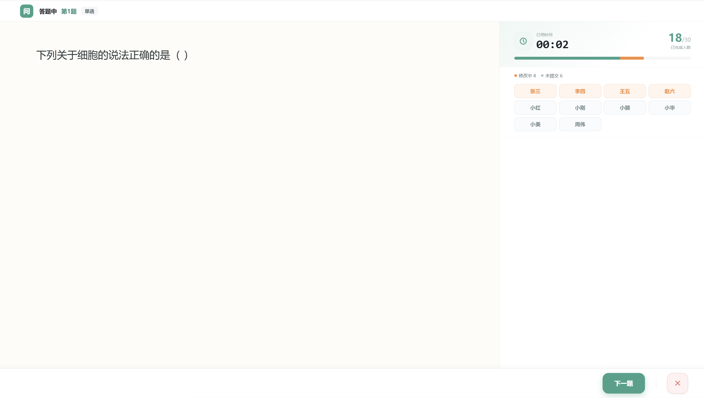

| 属性 | 值 |
|------|-----|
| **图片文件** | `多题答题中.png` |
| **路由** | `/ask/batch-answer`（待实现） |

#### 功能

| 按钮 | 说明 |
|------|------|
| **下一题** | 切换到下一题（当前不是最后一题时显示） |
| **结束答题** | 仅在**最后一题**时显示 → 跳转 **多题详情.png**（后续流程一致） |

```
第1题 → [下一题] → 第2题 → [下一题] → ... → 最后一题 → [结束答题] → 多题详情
```

---

### 4.22 拍照分析

> **触发**：P5 主观题拍照答题 → 朗背答题进行中 → [结束答题] → 路由跳转。

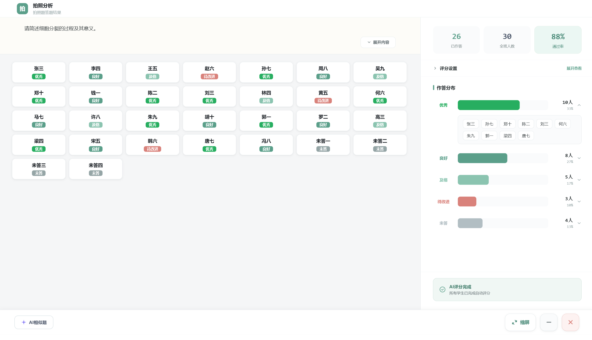

| 属性 | 值 |
|------|-----|
| **图片文件** | `拍照分析.png` |
| **路由** | `/ask/photo-analysis`（待实现） |

#### 功能

| 功能 | 类型 | 说明 |
|------|------|------|
| **左侧学生列表** | 路由跳转 | 点击某个学生 → 跳转 **语音学生答题分析.png**，携带 `studentId` |

---

### 4.23 选题提问完整链路

```
问面板 [自编/共享/教材/题库]
    │
    └── 路由跳转 ──→ 选题提问（四Tab）
                        │
                        ├── 左侧: 题集列表 / 树筛选 / 知识点树
                        ├── 顶部: 题型下拉 + 难度下拉
                        ├── 内容: 勾选题目（P5可主观 / S6/T2仅客观）
                        │
                        └── [开始提问]
                                │
                                ├── P5 主观·语音 → 朗背进行中 → 语音分析 → 语音学生分析
                                ├── P5 主观·拍照 → 朗背进行中 → 拍照分析 → 语音学生分析
                                ├── 客观·单题(1道) → 缩小答题进程 → 客观题详情
                                └── 客观·多题(≥2) → 多题答题中 → 多题详情
```

---

## 5. 线路二：测

### 5.1 功能描述

**"测"** — 课堂测验/考试功能。教师发布测验，学生在线作答，自动批改。

### 5.2 流程图

```
悬浮球展开
    │
    │ 点击 [测]
    ▼
┌─────────────────┐
│   测验列表页面    │  ← 路由: /test  (待实现)
│                 │
│  📸 贴图位置     │  > ``
│                 │
│  进行中的测验    │
│  历史测验记录    │
└────────┬────────┘
         │ 点击某个测验
         ▼
┌─────────────────┐
│   测验作答页面    │  ← 路由: /test/:id  (待实现)
│                 │
│  📸 贴图位置     │  > ``
│                 │
│  题目序号 1/10   │
│  题目内容        │
│  选项 / 填空     │
│  [上一题][下一题] │
│  [提交试卷]      │
└────────┬────────┘
         │ 提交试卷
         ▼
┌─────────────────┐
│   测验结果页面    │  ← 路由: /test/:id/result  (待实现)
│                 │
│  📸 贴图位置     │  > ``
│                 │
│  总分 / 排名     │
│  逐题解析        │
│  [返回列表]      │
└─────────────────┘
```

### 5.3 路由设计（待实现）

| 路由路径 | 路由名称 | 页面组件 | 说明 |
|----------|----------|----------|------|
| `/test` | `test-list` | `TestListView.vue` | 测验列表页 |
| `/test/:id` | `test-detail` | `TestDetailView.vue` | 测验作答页（全屏） |
| `/test/:id/result` | `test-result` | `TestResultView.vue` | 测验结果页 |

### 5.4 路由跳转方式

```js
// 从悬浮球点击 [测] → 跳转到测验列表
router.push('/test');
// 或
router.push({ name: 'test-list' });

// 从列表 → 进入测验（全屏模式，悬浮球隐藏）
router.push({ name: 'test-detail', params: { id: testId } });
// 全屏通过路由 meta 控制：
// { path: '/test/:id', meta: { fullscreen: true } }

// 提交后 → 跳转结果页
router.push({ name: 'test-result', params: { id: testId } });
```

### 5.5 全屏模式说明

> **重要**：测验作答页需要全屏模式（`meta: { fullscreen: true }`），此时：
> 1. 悬浮球自动隐藏
> 2. 鼠标穿透关闭（所有区域可交互）
> 3. 窗口保持置顶

```
测验作答页（全屏）流程：
  App.vue
    │
    ├── isFullscreenRoute = true  →  隐藏 FloatingBall
    │
    └── electronBridge.setFullscreenPage(true)
        electronBridge.setMousePassthrough(false)
                                          │
                                          ▼
                               整个窗口可交互，悬浮球不可见
```

### 5.6 当前实现状态

| 功能点 | 状态 | 备注 |
|--------|------|------|
| 悬浮球 [测] 按钮 | ✅ 已有 UI | `quickActions[1]`，无点击事件 |
| 测验列表页 | ❌ 待开发 | 路由和组件均未创建 |
| 测验作答页 | ❌ 待开发 | 需配置 `meta.fullscreen` |
| 测验结果页 | ❌ 待开发 | 同上 |

---

## 6. 线路三：析

### 6.1 功能描述

**"析"** — 学情分析/数据报告功能。展示学生学习数据、成绩分析、知识点掌握情况。

### 6.2 流程图

```
悬浮球展开
    │
    │ 点击 [析]
    ▼
┌─────────────────┐
│   分析总览页面    │  ← 路由: /analysis  (待实现)
│                 │
│  📸 贴图位置     │  > ``
│                 │
│  班级整体数据    │
│  - 平均分       │
│  - 通过率       │
│  - 知识点热力图  │
│                 │
│  [查看详情] ────→ 跳转 /analysis/student/:id
│  [导出报告] ────→ 跳转 /analysis/export
└────────┬────────┘
         │ 点击 [查看详情]
         ▼
┌─────────────────┐
│  学生个人分析页   │  ← 路由: /analysis/student/:id  (待实现)
│                 │
│  📸 贴图位置     │  > ``
│                 │
│  学生成绩趋势    │
│  薄弱知识点      │
│  推荐练习        │
│  [返回总览]      │
└────────┬────────┘
         │ 点击 [导出报告]
         ▼
┌─────────────────┐
│   报告导出页面    │  ← 路由: /analysis/export  (待实现)
│                 │
│  📸 贴图位置     │  > ``
│                 │
│  选择导出格式    │
│  选择时间范围    │
│  [生成报告]      │
└─────────────────┘
```

### 6.3 路由设计（待实现）

| 路由路径 | 路由名称 | 页面组件 | 说明 |
|----------|----------|----------|------|
| `/analysis` | `analysis-overview` | `AnalysisOverview.vue` | 分析总览页 |
| `/analysis/student/:id` | `analysis-student` | `StudentAnalysis.vue` | 学生个人分析 |
| `/analysis/export` | `analysis-export` | `ExportReport.vue` | 报告导出页 |

### 6.4 路由跳转方式

```js
// 从悬浮球点击 [析] → 跳转到分析总览
router.push('/analysis');
// 或
router.push({ name: 'analysis-overview' });

// 从总览 → 学生详情（带参数）
router.push({ name: 'analysis-student', params: { id: studentId } });

// 从总览 → 导出报告
router.push({ name: 'analysis-export' });

// 返回总览
router.push({ name: 'analysis-overview' });
// 或
router.back();
```

### 6.5 页面布局示意

> 📸 **贴图位置**：
> - `./images/analysis-overview.png` — 分析总览页截图
> - `./images/analysis-student.png` — 学生个人分析页截图
> - `./images/analysis-export.png` — 报告导出页截图

### 6.6 当前实现状态

| 功能点 | 状态 | 备注 |
|--------|------|------|
| 悬浮球 [析] 按钮 | ✅ 已有 UI | `quickActions[2]`，无点击事件 |
| 分析总览页 | ❌ 待开发 | 路由和组件均未创建 |
| 学生分析页 | ❌ 待开发 | 同上 |
| 报告导出页 | ❌ 待开发 | 同上 |

---

## 7. 下课流程

### 7.1 流程图

```
悬浮球展开
    │
    │ 点击 [⏻ 下课]
    ▼
┌─────────────────────────────┐
│  确认下课？                   │
│  （当前直接触发，无确认弹窗）   │
│                             │
│  FloatingBall emit("dismiss")│
└────────────┬────────────────┘
             │
             ▼
┌─────────────────────────────┐
│  App.vue handleDismissClass  │
│                             │
│  1. classStarted = false    │
│  2. classSession = undefined│
│  3. 悬浮球隐藏               │
│  4. 启动面板重新显示          │
└─────────────────────────────┘
```

### 7.2 关键代码位置

- 下课按钮：[FloatingBall.vue:19-28](../src/components/FloatingBall.vue#L19-L28)
- 下课事件处理：[FloatingBall.vue:153-157](../src/components/FloatingBall.vue#L153-L157)
- 根组件下课处理：[App.vue:83-87](../src/App.vue#L83-L87)

---

## 8. 路由一览

### 8.1 当前路由表

| 路径 | 名称 | 组件 | 全屏 | 状态 |
|------|------|------|------|------|
| `/` | `home` | `HomeView.vue` | ❌ | ✅ 已实现 |
| `/:pathMatch(.*)*` | — | 重定向到 `/` | — | ✅ 已实现 |

> **注意**：当前使用 **Hash 模式** (`createWebHashHistory`)，所以实际 URL 为 `http://127.0.0.1:5173/#/`。

### 8.2 规划路由表（待实现）

| 路径 | 名称 | 组件 | 全屏 | 所属线路 |
|------|------|------|------|----------|
| `/ask` | `ask-list` | `AskListView` | ❌ | 问 |
| `/ask/:id` | `ask-detail` | `AskDetailView` | ❌ | 问 |
| `/ask/:id/result` | `ask-result` | `AskResultView` | ❌ | 问 |
| `/test` | `test-list` | `TestListView` | ❌ | 测 |
| `/test/:id` | `test-detail` | `TestDetailView` | ✅ | 测 |
| `/test/:id/result` | `test-result` | `TestResultView` | ❌ | 测 |
| `/analysis` | `analysis-overview` | `AnalysisOverview` | ❌ | 析 |
| `/analysis/student/:id` | `analysis-student` | `StudentAnalysis` | ❌ | 析 |
| `/analysis/export` | `analysis-export` | `ExportReport` | ❌ | 析 |

### 8.3 完整的路由配置代码（规划）

```js
// src/router/index.js — 完整规划版
import { createRouter, createWebHashHistory } from 'vue-router';
import HomeView from '../views/HomeView.vue';

const router = createRouter({
  history: createWebHashHistory(),
  routes: [
    // ===== 主页（悬浮球待命页） =====
    {
      path: '/',
      name: 'home',
      component: HomeView,
    },

    // ===== 线路一：问 =====
    {
      path: '/ask',
      name: 'ask-list',
      component: () => import('../views/ask/AskListView.vue'),
    },
    {
      path: '/ask/:id',
      name: 'ask-detail',
      component: () => import('../views/ask/AskDetailView.vue'),
    },
    {
      path: '/ask/:id/result',
      name: 'ask-result',
      component: () => import('../views/ask/AskResultView.vue'),
    },

    // ===== 线路二：测 =====
    {
      path: '/test',
      name: 'test-list',
      component: () => import('../views/test/TestListView.vue'),
    },
    {
      path: '/test/:id',
      name: 'test-detail',
      component: () => import('../views/test/TestDetailView.vue'),
      meta: { fullscreen: true },   // ← 全屏模式，隐藏悬浮球
    },
    {
      path: '/test/:id/result',
      name: 'test-result',
      component: () => import('../views/test/TestResultView.vue'),
    },

    // ===== 线路三：析 =====
    {
      path: '/analysis',
      name: 'analysis-overview',
      component: () => import('../views/analysis/AnalysisOverview.vue'),
    },
    {
      path: '/analysis/student/:id',
      name: 'analysis-student',
      component: () => import('../views/analysis/StudentAnalysis.vue'),
    },
    {
      path: '/analysis/export',
      name: 'analysis-export',
      component: () => import('../views/analysis/ExportReport.vue'),
    },

    // ===== 兜底 =====
    {
      path: '/:pathMatch(.*)*',
      redirect: '/',
    },
  ],
});

export default router;
```

### 8.4 对应的目录结构（规划）

```
src/
├── views/
│   ├── HomeView.vue              ← 已有
│   ├── ask/
│   │   ├── AskListView.vue       ← 待创建
│   │   ├── AskDetailView.vue     ← 待创建
│   │   └── AskResultView.vue     ← 待创建
│   ├── test/
│   │   ├── TestListView.vue      ← 待创建
│   │   ├── TestDetailView.vue    ← 待创建
│   │   └── TestResultView.vue    ← 待创建
│   └── analysis/
│       ├── AnalysisOverview.vue  ← 待创建
│       ├── StudentAnalysis.vue   ← 待创建
│       └── ExportReport.vue      ← 待创建
├── router/
│   └── index.js                  ← 待扩展
├── components/
│   ├── ClassroomLauncher.vue     ← 已有
│   └── FloatingBall.vue          ← 已有（需为三个按钮添加点击事件）
└── App.vue                       ← 已有
```

---

## 附录 A：贴图清单

> 建议在 `docs/images/` 目录下存放所有截图。

| 序号 | 文件名 | 内容 | 尺寸建议 |
|------|--------|------|----------|
| 1 | `launcher-full.png` | 启动面板完整截图 | 800×852 |
| 2 | `floating-ball-collapsed.png` | 悬浮球收起态 | ~200×200 |
| 3 | `floating-ball-expanded.png` | 悬浮球展开态 | ~300×400 |
| 4 | `ask-list.png` | 问 - 问题列表页 | 全屏截图 |
| 5 | `ask-detail.png` | 问 - 问题详情页 | 全屏截图 |
| 6 | `ask-result.png` | 问 - 答题结果页 | 全屏截图 |
| 7 | `test-list.png` | 测 - 测验列表页 | 全屏截图 |
| 8 | `test-answer.png` | 测 - 测验作答页 | 全屏截图 |
| 9 | `test-result.png` | 测 - 测验结果页 | 全屏截图 |
| 10 | `analysis-overview.png` | 析 - 分析总览页 | 全屏截图 |
| 11 | `analysis-student.png` | 析 - 学生分析页 | 全屏截图 |
| 12 | `analysis-export.png` | 析 - 导出报告页 | 全屏截图 |

---

## 附录 B：悬浮球按钮事件绑定（快速参考）

当前 [FloatingBall.vue:82-86](../src/components/FloatingBall.vue#L82-L86) 中的 `quickActions` 只有 UI，需要添加点击事件来触发路由跳转：

```vue
<!-- FloatingBall.vue 模板中，为每个 menu-ball 添加 @click -->
<button
  v-for="action in quickActions"
  :key="action.key"
  class="menu-ball"
  :class="`is-${action.tone}`"
  data-overlay-hitbox="true"
  type="button"
  @click="handleActionClick(action.key)"    <!-- ← 新增 -->
>
  {{ action.label }}
</button>
```

```js
// <script setup> 中新增方法
import { useRouter } from 'vue-router';

const router = useRouter();

const routeMap = {
  ask: '/ask',
  test: '/test',
  analysis: '/analysis',
};

function handleActionClick(key) {
  const path = routeMap[key];
  if (path) {
    expanded.value = false;   // 收起菜单
    router.push(path);         // 跳转路由
  }
}
```
